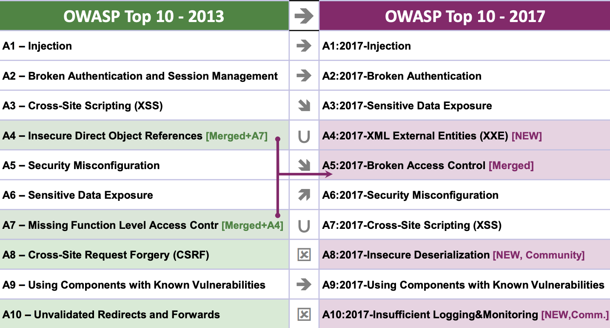
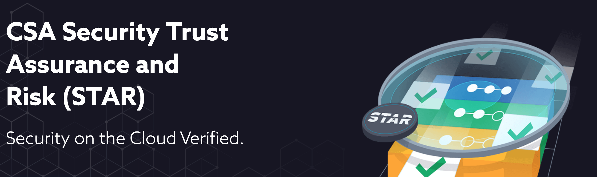

# CYBER SECURITY COMPENDIUM


### NAVIGATION
<br />	
<br />


| SECTION | TOPICS|
| ------------- | ------------- |
| CHAPTER 1   | [Frameworks](#FRAMEWORKS)  |
| CHAPTER 2  | [Cyber Tools](#CYBER-TOOLS)  |
| CHAPTER 3  | [Knowledge Resources](#KNOWLEDGE-RESOURCES)  |
| CHAPTER 4   | [Next-Gen Cyber Intelligence](#NEXT-GEN-INTELLIGENT-INTELLIGENCE)  |
| CHAPTER 5   | [DevSecOps](#NEXT-GEN-INTELLIGENT-INTELLIGENCE)  |
| CHAPTER 6   | [Compliance Frameworks](#COMPLIANCE)  |


<br />
<br />
<br />
<br />
<br />
<br />
<br />
<br />
<br />
<br />
<br />

### FULL CONTENTS

<br />	
<br />


| SECTION | TOPICS|
| ------------- | ------------- |
| **CHAPTER 1**   | [Frameworks](#FRAMEWORKS)  |
| *NIST FRAMEWORK*   | [NIST](#NIST-FRAMEWORK)  |
| Open Web Application Security Project  | [OWASP](#Resource-Link)  |
| Zero Trust Security  | [ZEROTRUST](#Zero-Trust-Security)  |
| OSINT  | [OSINT](#Open-Source-Intelligence)  |
| **CHAPTER 2**  | [Cyber Tools](#CYBER-TOOLS)  |
| AWS Guard​Duty   | [Guard​Duty](#Guard​Duty)  |
| Crowd Strike   | [Crowd Strike](#Crowd-Strike)  |
| Hack the Box   | [HTB](#Hack-The-Box)  |
| ThreatConnect  | [ThreatConnect](#ThreatConnect)  |
| Bloodhound  | [Bloodhound](#Bloodhound)  |
| MISP  | [MISP](#MISP)  |
| Cyber Chef  | [Cyber Chef](#Cyber-Chef)  |
| **CHAPTER 3**  | [Knowledge Resources](#KNOWLEDGE-RESOURCES)  |
| Signature Wrapping  | [SIGNATURE WRAPPING ATTACK](#SIGNATURE-WRAPPING-ATTACK)  |
| AWESOME PENTEST  | [AWESOME PENTEST](#AWESOME-PENTEST)  |
| How to NMAP   | [MAPPING PORTS](#HOW-TO-NMAP)  |
| **CHAPTER 4**   | [Next-Gen Cyber Intelligence](#NEXT-GEN-INTELLIGENT-INTELLIGENCE)  |
| AI FOR OFFENCE | [DARKTRACE WHITEPAPER](#DARKTRACE-WHITEPAPER)  |
|   | [NEURALNET INJECTION](#ML-INJECTION )  |
|    | [ML N-MAP ](#ML-N-MAP  )  |
|  | [SQL-INJECTION-TURBOCHARGING ](#SQL-INJECTION-TURBOCHARGING )  |
| AI FOR DEFENCE | [AI FOR DEFENCE](#AI-FOR-DEFENCE)  |
|  | [BEST PRACTICES](#BEST-PRACTICES)  |
|   | [ROBUST AI FRAUD ARCHITECTURES](#ROBUST-AI-FRAUD-ARCHITECTURES)  |
|  | [Dynamic GCP ](#GCP-RECOMMENDATIONS)  |
| CHAPTER 5   | [DevSecOps](#NEXT-GEN-INTELLIGENT-INTELLIGENCE)  |
| CHAPTER 6   | [Compliance Frameworks](#COMPLIANCE)  |
| CSA STAR  | [Cloud Auditing](#CSA-STAR)  |
| ISO 27001 | [Policy Auditing](#AISO-27001)  |
| Leidos   | [Accredited Testing](#LEIDOS)  |
| PCI 3.2   | [Data Security Standard](#PCI-DSS)  |
| PCI HIPAA   | [HIPAA](#PCI-HIPAA)  |
  

<br />
<br />
<br />
<br />
<br />
<br />
<br />
<br />
<br />
<br />
<br />
<br />
<br />
<br />
<br />
<br />
<br />
<br />
<br />

# FRAMEWORKS 

### [JUMP TO TOP](#NAVIGATION) 

| Topic | Quick Jump |
| ------------- | ------------- |
| NIST FRAMEWORK   | [NIST](#NIST-FRAMEWORK)  |
| Open Web Application Security Project  | [OWASP](#Resource-Link)  |
| Zero Trust Security  | [ZEROTRUST](#Zero-Trust-Security)  |
| OSINT  | [OSINT](#Open-Source-Intelligence)  |

<br />


## NIST FRAMEWORK 

On February 12th 2013, president Obama issued executive order **13636** to improve **critical infrastructure cyber security**. One year later NIST released a voluntary framework, which can be considered as a living/evolving document.
This differs from other compliance such as PCI, HIPAA - this is a general overview framework that is relevant hierarchically for all people form all backgrounds. The idea is to help people organize their thoughts and strategies to better improve communication and cyber security posture. 

<br />


<br />

NIST FRAMEWORK  [NIST](https://www.nist.gov/cyberframework) 

<br />

This innovation behind the strategy is broken down into few core pillars, **identify**, **protect**, **detect**, **respond** and **recover**.  

**Identification**. is highly important in areas such as mergers, new onboarding and acquisitions when you don’t know what you are getting.  We spend a lot of time inside our own networks  scanning and discovering new devices, not just assets under our management but also assets that don’t belong on our network.

<br />

# Open Web Application Security Project (OWASP) 


### Resource Link
- [OWASP](https://www.owasp.org/index.php/Main_Page)


  


The Open Web Application Security Project (OWASP) is an online community that produces freely-available articles, methodologies, documentation, tools, and technologies in the field of web application security

<br />
<br />

## OWASP TOP 10


[download the guide](https://www.owasp.org/images/7/72/OWASP_Top_10-2017_%28en%29.pdf.pdf)

The goal of **OWASP TOP 10** is to educate developers, architects, managers, organizations, and designers about the consequences of the most common and most important web application security weakness. OWASP TOP 10 provides **basics techniques** to protect against these high-risk problems and give guidance what to do next


<br />
<br />


## Zero Trust Security

`"The perimeter is dead: Long live the micro perimeter."`


It's time to abandon the caslte and mote analogy for security. 

The Zero Trust model is primarily concerned around network security, the old way of doing things was that you focused on securing your network from external actors - however internal comunicaiton was relatively unrestricted *(the thinking being, that if you are inside the perimiter then you are a good actor)*. However, this means like the story of Troy, once the attackers made it passed the castle wall, they were free to cause unfettered dmage. 
  
  
In a Zero Trust model, you cannot trust anything in or out of your network: creating a new type of data-centric perimeter around information and protecting it with strong encryption techniques tied to intelligent authentication is the best security approach. Blindly allowing users to access the data without checking their identity negates the entire security stack.

**Implementations** 

- [Zscaler](https://www.zscaler.com/mission-possible-zero-trust-security)
- [Cisco](https://www.cisco.com/c/en/us/products/security/zero-trust.html)
- [Akami](https://www.akamai.com/uk/en/solutions/security/zero-trust-security-model.jsp)
- [Symantec](https://www.symantec.com/en/uk/solutions/zero-trust-ecosystem)

**Mechanism** 

Example 1 - use **Bastion hosts** .

A bastion host is a special-purpose computer on a network specifically designed and configured to withstand attacks. The computer generally hosts a single application, for example a proxy server, and all other services are removed or limited to reduce the threat to the computer

<br />
<br />
<br />

## Open Source Intelligence


OSINT differs largely from the other frameworks, in that it is primarily a hackers framework *(but lies in a grey area)*, but can also be used for defence by 'knowing the enemy' and understanding common attack surfaces. OSINT framework focused on gathering information from free tools or resources. The intention is to help people find free OSINT resources.

**Resources**

- [OSINT Compendium](https://osintframework.com/)  
- [Top 10 OSINT tools](https://www.greycampus.com/blog/information-security/top-open-source-intelligence-tools)

<br />
<br />
<br />
<br />

# CYBER TOOLS 

### [JUMP TO TOP](#NAVIGATION) 

| Topic | Quick Jump |
| ------------- | ------------- |
| AWS Guard​Duty   | [Guard​Duty](#Guard​Duty)  |
| Crowd Strike   | [Crowd Strike](#Crowd-Strike)  |
| Hack the Box   | [HTB](#Hack-The-Box)  |
| ThreatConnect  | [ThreatConnect](#ThreatConnect)  |
| Bloodhound  | [Bloodhound](#Bloodhound)  |
| MISP  | [MISP](#MISP)  |
| Cyber Chef  | [Cyber Chef](#Cyber-Chef)  |


<br />
<br />
<br />
<br />
<br />
<br />
<br />
<br />
<br />
<br />
<br />
<br />
<br />
<br />
<br />
<br />
<br />
<br />
<br />

## Guard​Duty


- Home[here](https://aws.amazon.com/guardduty/)
- Info [here](https://searchaws.techtarget.com/definition/Amazon-GuardDuty)


<br />
<br />
<br />
<br />


## Crowd Strike


- EndPoint Protection[here](https://www.crunchbase.com/organization/crowdstrike)
- Case Study [here](https://aws.amazon.com/solutions/case-studies/crowdstrike/)


CrowdStrike is a leader in cloud-delivered, next-generation services for endpoint protection, threat intelligence, and response. The CrowdStrike Falcon platform stops breaches by preventing and responding to all types of attacks—both malware and malware-free. The company has revolutionized endpoint protection by combining next-generation anti-virus technology with endpoint detection and response, coupled with a 24/7 managed hunting service, all delivered via the cloud in a single integrated solution. Falcon uses the patented CrowdStrike Threat Graph™ to analyze and correlate billions of events in real time, providing complete protection and five-second visibility across all endpoints. CrowdStrike Falcon is currently deployed in more than 170 countries. 


<br />
<br />
<br />
<br />

## Hack The Box


- Hack the Box [here](https://www.hackthebox.eu/)
- Hack the Box tutorial [here](https://0xrick.github.io/hack-the-box/teacher/)


<br />
<br />

## ThreatConnect


- Home Site [here](https://threatconnect.com)


  
<br />
<br />


## Bloodhound


- Wiki Site [here](https://github.com/BloodHoundAD/Bloodhound/wiki)


  
<br />
<br />

## MISP


- Home Site [here](https://www.misp-project.org/)


  
<br />
<br />

## Cyber Chef


- CyberChef [here](https://github.com/gchq/CyberChef)
- CyberSaucier [here](https://github.com/DBHeise/CyberSaucier)


  
<br />
<br />
<br />
  
# KNOWLEDGE RESOURCES 
  
### [JUMP TO TOP](#NAVIGATION) 

| Topic | Quick Jump |
| ------------- | ------------- |
| Signature Wrapping  | [SIGNATURE WRAPPING ATTACK](#SIGNATURE-WRAPPING-ATTACK)  |
| AWESOME PENTEST  | [AWESOME PENTEST](#AWESOME-PENTEST)  |
| How to NMAP   | [MAPPING PORTS](#HOW-TO-NMAP)  |

<br />
<br />
<br />
<br />
<br />
<br />
<br />
<br />
<br />
<br />
<br />
<br />
<br />
<br />
<br />
<br />
<br />
<br />
<br />


## SIGNATURE WRAPPING ATTACK
- Signature Wrapping [Here](https://www.ws-attacks.org/XML_Signature_Wrapping) 
  

## AWESOME PENTEST
    
- AWESOME-PENTEST  [PENTEST](https://github.com/enaqx/awesome-pentest)

  
## HOW TO NMAP
  

  
- NMAP How to [NMAP](https://hackertarget.com/nmap-tutorial/)


<br />
<br />
<br />
  
# NEXT-GEN INTELLIGENT INTELLIGENCE  

### [JUMP TO TOP](#NAVIGATION) 

| Topic | Quick Jump |
| ------------- | ------------- |
| AI FOR OFFENCE | [DARKTRACE WHITEPAPER](#DARKTRACE-WHITEPAPER)  |
|   | [NEURALNET INJECTION](#ML-INJECTION )  |
|    | [ML N-MAP ](#ML-N-MAP  )  |
|  | [SQL-INJECTION-TURBOCHARGING ](#SQL-INJECTION-TURBOCHARGING )  |
| AI FOR DEFENCE | [AI FOR DEFENCE](#AI-FOR-DEFENCE)  |
|  | [BEST PRACTICES](#BEST-PRACTICES)  |
|   | [ROBUST AI FRAUD ARCHITECTURES](#ROBUST-AI-FRAUD-ARCHITECTURES)  |
|  | [Dynamic GCP ](#GCP-RECOMMENDATIONS)  |


<br />
<br />
<br />
<br />
<br />
<br />
<br />
<br />
<br />
<br />
<br />
<br />
<br />
<br />
<br />
<br />
<br />
<br />
<br />


# AI FOR OFFENCE

## DARKTRACE WHITEPAPER


### The Next Paradigm Shift 

**AI-Driven Cyber-Attacks**

[LINK](https://www.darktrace.com/en/resources/wp-ai-driven-cyber-attacks.pdf)


This report exampines the present state of the threatlandscape and explore the role narrow artificial intelligence (AI) will play in cyber-offense.
It presents three scenarios where advanced threats have achieved high levels of sophistication for specific, isolated characteristics. 

1. Autonomous malware
2. Intelligent evasion techniques
3. Low-and-slow data exfiltration 


Each threat covers a different phase of the attack lifecycle:

- Lateral movement
- Command & control traffic
- Data exfiltration

## SQL INJECTION TURBOCHARGING

- OBTAIN LIST OF 1000+ SQL INJECTION METHODS
- LABEL BASED ON TARGET OS, TARGET APPLICATION ETC
- CLASSIFY (SUCCESS/FAILURE/NA)
- PRODUCE MODEL THAT OFFERS THE BEST ATTACK VECTOR FOR A GIVEN TARGET


## ML INJECTION 

The ultimate attack profile. 

1. Decimenate payload on target machine 
2. Payload acts as intelligent trojan, using client side training or federated learning. 
3. Probing and moving itself reactively, not based on static if/or statements, but actually adapting to anti-virus software.


## ML N-MAP 

Consider a network trained to detect running ports, vulnerabilities etc. 

[REF](https://www.researchgate.net/publication/327786263_Using_Deep_Learning_Model_for_Network_Scanning_Detection)

<br />
<br />
<br />
<br />


# AI FOR DEFENCE

## BEST PRACTICES 

**Machine Learning In Cyber Threat Detection**

```
LEARN ATTACK PROFILES
```

**AI, Password Protection and Authentication**

```
Biometrics are easily circumvented

AI can enhanced FACE ID tampering
```


**AI-ML In Phishing Detection And Prevention Control**

**Usage of AI-ML In Vulnerability Management**

```
Detect open ports
Detect Unpatched servers, botched patches, patch clashes 
Detect AD hijacking
```

**Behavioral Analytics with AI**

```
Profile malicious users based on activities that haven’t quite crossed the line.	

```


# ROBUST AI FRAUD ARCHITECTURES

Many compnaies are now building end to end machine learning pipelines to lock down services instead of hiring humans to do the analytics and prevention. 
  

### SETBACKS   

These models use hundreds if not thousands of data points to accurately classify a transaction as valid or not. Even the most sophisticated methods are unable to correctly identify a lot of fraudulent transactions.

- Biggest issues with A.I fraud engines is that they quickly become irrelevant.
- This is because fraud tactics change in real time. 
- Customer data used to predict fraud today, becomes irrelevant tomorrow.
  
  
### AI ARCHITECTURE

  

Example of a new scalable Fraud prevention architecture.

*"An app which organisations can embedd into their product, so that they generate realtime fraud metrics that act as a quality gate on transactions"*


- APP hosted on cloud (GCP, AWS etc)
- Client side, they implement some js or trigger to A.I cloud hosted service 
- On the checkout page (Say as a customer busy/sells something) the snippet is added
- USER META data is sent (Time on page, IP address, The web browser they are using) automatically
- Standard google analytics process (they make their clients do it too )
- API call will need to be implemented to send sensitive user purchase data (card details) and encrypt it.
- Sensitive and User meta data is concatinated into the machine learning model 
- A score is produce (how likely the transaction is to be fraud based on score)

### 2020 AI ARCHITECTURE

This is so 2019 

Weaknesses include `non gdpr compliant` because data is encrypted, but shared without permission. So information is secure, but not compliant. 

We need to ...

```
Modify architecture to preserve privacy and learn from User data 
```

1. First encrypt User data 
2. Then perform CLIENT side machine learning from it.
3. So we send to the server, not the **RAW DATA** but what it has **LEARNED** from the data.
4. This is in the form of an encrypted weights file 
5. 

### KEY FEATURES

1. Continuous Training
2. Federated Learning (Client Side)
3. Model Encryption, Share only the encrypted weights back to server
4. Secure Multi-party compliant communication 

### KEY STRATEGIES

- Utilize cloud 
**LAMBDA KINESIS S3 ATHENA**
- Make responsive just in time triggers (serverless)
- Streat data in real time 

### INFRASTRUCTURE STRATEGY 

Request to API is initiated 
AWS app passes request to Lambda (event driven compute)
Feeds into kinesis an AWS tool capable of processing hundreds of terrabytes of data per hour 
Operating laws, social media feeds, our case fin tranactions
Kinesis helps us avoid heavy queuing by creating a scalable datastream and sharding
Then we use firehose functionality to write functionality to S3 
Then we query S3 database using Athena so we can immediately display it in analytics dashboards

<br />
<br />
<br />


## GCP RECOMMENDATIONS


Recommenders automatically analyze usage patterns to help determine if resources and policies within Google Cloud are optimally configured. Data usage information is not shared in the process.

With the **Cloud Identity and Access Management (Cloud IAM) Recommender**, you can automatically detect weak access policies and adjust them based on the access patterns of similar users in your organization. This is a follow up to the Alpha launch at Cloud Next this past April.

The Google Compute Engine Rightsizing Recommender helps you choose the optimal virtual machine size for your workload. Our experience working with customers shows that they often initially provision machines that are too small or too large.


# COMPLIANCE 


### [JUMP TO TOP](#NAVIGATION) 

| Topic | Quick Jump |
| ------------- | ------------- |
| CSA STAR  | [Cloud Auditing](#CSA-STAR)  |
| ISO 27001 | [Policy Auditing](#AISO-27001)  |
| Leidos   | [Accredited Testing](#LEIDOS)  |
| PCI 3.2   | [Data Security Standard](#PCI-DSS)  |
| PCI HIPAA   | [HIPAA](#PCI-HIPAA)  |

<br />
<br />
<br />
<br />


## CSA STAR 


  
[Testing Overview](https://cloudsecurityalliance.org/star/levels/) 


CSA star is a **Open Certification Framework** for an organisations cloud controls.

CSA STAR Self-Assessment is a complimentary offering that documents the security controls provided by various cloud computing offerings, thereby helping users assess the security of cloud providers they currently use or are considering using. Cloud providers either submit a completed Consensus Assessments Initiative Questionnaire (CAIQ), or submit a report documenting compliance with the Cloud Controls Matrix (CCM). This information then becomes publicly available, promoting industry transparency and providing customer visibility into specific provider security practices.

Three main levels:

1. Self Assesment 
2. Third Party Audit
3. Continuous Audit


**Level one** organizations can submit one or both of the security and privacy self-assessments. **Level two** Organizations looking for a third-party audit can choose from one or more of the security and privacy audits and certifications. An organization’s location, along with the regulations and standards it is subject to will have the greatest factor in determining which ones are appropriate to pursue.

<br />
<br />

## ISO 27001 


[ISO DEFINITION](https://whatis.techtarget.com/definition/ISO-27001)

ISO 27001 is a specification for an information security management system (ISMS). An ISMS is a framework of policies and procedures that includes all legal, physical and technical controls involved in an organisation's information risk management processes.

ISO 27001 uses a topdown, risk-based approach and is technology-neutral. The specification defines a six-part planning process:

1. Define a security policy.
2. Define the scope of the ISMS.
3. Conduct a risk assessment.
4. Manage identified risks.
5. Select control objectives and controls to be implemented.
6. Prepare a statement of applicability.


ISO 27002 contains 12 main sections:

1. Risk assessment
2. Security policy
3. Organization of information security
4. Asset management
5. Human resources security
6. Physical and environmental security
7. Communications and operations management
8. Access control
9. Information systems acquisition, development and maintenance
10. Information security incident management
11. Business continuity management
12. Compliance


<br />
<br />

## LEIDOS


[Testing Overview](https://www.leidos.com/competencies/cyber/accredited-testing-evaluation)


- Common Criteria
- FIPS 140-2
- GSA FIPS 201& NIST PIV
- SCAP
- TWIC
- CONSULTING
- SCAP
- TWIC 

The Leidos Accredited Testing & Evaluation Laboratory is comprised of two industry leading laboratories: Common Criteria and FIPS 140-2. Both are accredited by the National Voluntary Laboratory Accreditation Program (NVLAP Lab Code: 200427-0) and provide IT security evaluation and testing services for commercial companies to meet their federal and international sales acquisition requirements. Our labs have in aggregate certified more than 1,000 commercial products.

<br />
<br />

## PCI DSS
### PCI 3.2

The Payment Card Industry Security Standards Council (PCI SSC) has published a
new version of the industry standard that businesses use to safeguard payment data
before, during and after purchase. 


[Resource Guide](https://www.pcisecuritystandards.org/pdfs/PCI_DSS_Resource_Guide_(003).pdf)


PCI DSS requirements apply to all organizations that store, process, or transmit cardholder data. PCI HIPAA compliance is about addressing specific, finite requirements to safeguard the integrity of financial information. PCI HIPAA compliance focuses heavily on network and data security.


## PCI HIPAA 


[Home Page](https://pcihipaa.com/)


PCI DSS requirements apply to all organizations that store, process, or transmit cardholder data. PCI HIPAA compliance is about addressing specific, finite requirements to safeguard the integrity of financial information. PCI HIPAA compliance focuses heavily on network and data security.